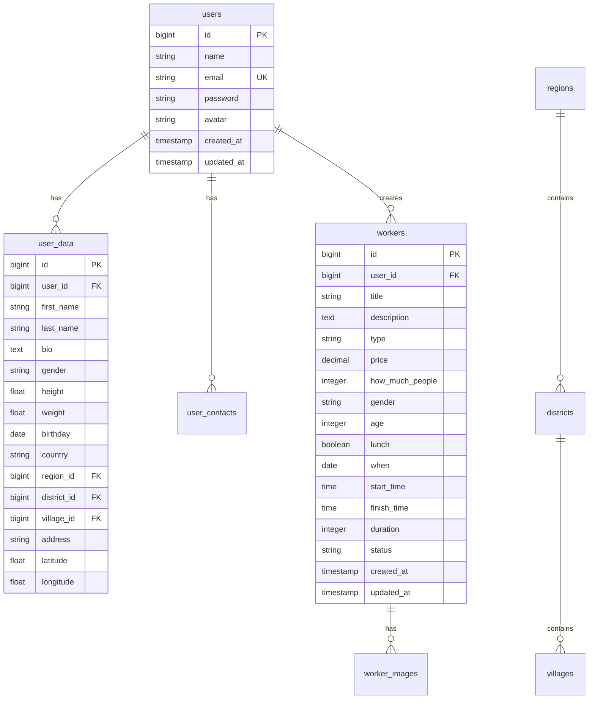

# IjaraUz - Kunlik Ish va Ishchilar Platformasi


O'zbekistondagi eng yirik kunlik ish topish va ishchi yollash platformasi. IjaraUz orqali ish beruvchilar tez va oson tarzda ishchilarni topadi, ishchilar esa o'zlariga mos ishlarni topishadi.

## 🌟 Asosiy Xususiyatlar

- ✅ **Ish Beruvchilar uchun** - Ish joylashtirish, ishchilarni qidirish, baholash
- ✅ **Ishchilar uchun** - Ish qidirish, profil yaratish, daromad olish
- ✅ **Real-time qidiruv** - Joylashuv, kategoriya, narx bo'yicha filtr
- ✅ **Baholash tizimi** - Har bir foydalanuvchi uchun reyting
- ✅ **Xavfsiz to'lov** - Ishonchli tranzaksiyalar
- ✅ **Mobile-friendly** - Barcha qurilmalarda ishlaydi

## 📱 Demo

**Live Demo:** [ijarauz.uz](https://ijarauz.uz)  
**Admin Panel:** `/admin`  
**Test User:** test@ijarauz.uz | password123

## 🚀 Tezkor O'rnatish

### 1. Loyihani klonlash
```bash
git clone https://github.com/username/ijara-uz.git
cd ijara-uz
```

### 2. Environment sozlamalari
```bash
cp .env.example .env
php artisan key:generate
```

### 3. Database sozlash
`.env` faylini tahrirlang:
```env
DB_CONNECTION=mysql
DB_HOST=127.0.0.1
DB_PORT=3306
DB_DATABASE=ijara_uz
DB_USERNAME=root
DB_PASSWORD=
```

### 4. Dependency'larni o'rnatish
```bash
composer install
npm install && npm run build
```

### 5. Database migratsiya
```bash
php artisan migrate --seed
```

### 6. Storage link
```bash
php artisan storage:link
```

### 7. Serverni ishga tushirish
```bash
# Development server
php artisan serve

# Yoki production uchun
php artisan serve --host=0.0.0.0 --port=8000
```

## 📁 Loyiha Tuzilishi

```
ijara-uz/
├── app/
│   ├── Http/
│   │   ├── Controllers/
│   │   │   ├── AdminController.php
│   │   │   ├── AuthController.php
│   │   │   ├── ProfileController.php
│   │   │   └── WorkerController.php
│   │   └── Middleware/
│   ├── Models/
│   │   ├── User.php
│   │   ├── Worker.php
│   │   ├── UserData.php
│   │   ├── UserContact.php
│   │   ├── Region.php
│   │   ├── District.php
│   │   └── Village.php
│   └── Providers/
├── database/
│   ├── migrations/
│   │   ├── 2014_10_12_000000_create_users_table.php
│   │   ├── 2024_01_01_create_user_data_table.php
│   │   ├── 2024_01_02_create_user_contacts_table.php
│   │   ├── 2024_01_03_create_regions_table.php
│   │   ├── 2024_01_04_create_workers_table.php
│   │   └── 2024_01_05_create_worker_images_table.php
│   └── seeders/
│       └── DatabaseSeeder.php
├── public/
│   ├── css/
│   ├── js/
│   └── storage/ -> /storage/app/public
├── resources/
│   ├── views/
│   │   ├── layouts/
│   │   ├── auth/
│   │   ├── admin/
│   │   ├── workers/
│   │   ├── profile/
│   │   └── welcome.blade.php
│   └── lang/
├── routes/
│   ├── web.php
│   ├── api.php
│   └── admin.php
└── tests/
```

## 🗄️ Database Diagram



## 🔐 Authentication System

Platforma Laravel Breeze yoki Jetstream asosida qurilgan:

### Foydalanuvchi Turlari:
1. **Ish Beruvchi** - Ish joylashtiradi, ishchilarni baholaydi
2. **Ishchi** - Ish qidiradi, profil yaratadi
3. **Admin** - Platformani boshqaradi

### Ro'yxatdan o'tish jarayoni:
1. Email va parol kiritish
2. Telefon raqamini tasdiqlash
3. Profilni to'ldirish
4. Kategoriyani tanlash

## 🎨 Frontend Stack

- **TailwindCSS 3.x** - Utility-first CSS framework
- **Alpine.js** - Minimal JavaScript framework
- **Font Awesome 6** - Ikonkalar
- **Google Fonts (Inter)** - Zamonaviy font

### CSS Komponentlar:
```css
/* Asosiy ranglar */
--primary: #4f46e5;  /* Indigo-600 */
--secondary: #10b981; /* Emerald-500 */
--accent: #f59e0b;   /* Amber-500 */

/* Responsive breakpoints */
sm: 640px, md: 768px, lg: 1024px, xl: 1280px
```

## 📊 API Endpoints

### Public API:
```http
GET    /api/workers          # Ishlar ro'yxati
GET    /api/workers/{id}     # Ish ma'lumotlari
GET    /api/regions          # Viloyatlar ro'yxati
GET    /api/regions/{id}/districts  # Tumanlar
GET    /api/districts/{id}/villages # Qishloqlar
```

### Auth Required API:
```http
POST   /api/workers          # Yangi ish joylash
PUT    /api/workers/{id}     # Ishni yangilash
DELETE /api/workers/{id}     # Ishni o'chirish
POST   /api/apply/{id}       # Ishga ariza yuborish
GET    /api/profile          # Profil ma'lumotlari
```

## 🛠️ Development

### Development Server
```bash
# Frontend development
npm run dev

# Backend development
php artisan serve

# Watch for changes
npm run watch
```

### Testing
```bash
# Unit tests
php artisan test

# Feature tests
php artisan test --testsuite=Feature

# Browser tests
php artisan dusk
```

### Production Build
```bash
# Compile assets
npm run build

# Optimize Laravel
php artisan optimize
php artisan config:cache
php artisan route:cache
php artisan view:cache
```

## 🔧 Environment Variables

```env
APP_NAME=IjaraUz
APP_ENV=production
APP_DEBUG=false
APP_URL=https://ijarauz.uz

DB_CONNECTION=mysql
DB_HOST=127.0.0.1
DB_PORT=3306
DB_DATABASE=ijara_uz
DB_USERNAME=ijara_user
DB_PASSWORD=secure_password

MAIL_MAILER=smtp
MAIL_HOST=smtp.gmail.com
MAIL_PORT=587
MAIL_USERNAME=info@ijarauz.uz
MAIL_PASSWORD=app_password
MAIL_ENCRYPTION=tls

GOOGLE_MAPS_API_KEY=your_google_maps_key
```

## 📈 Deployment

### 1. Server talablari
- PHP 8.1+
- MySQL 5.7+ yoki MariaDB 10.3+
- Composer 2.0+
- Node.js 16+
- Nginx yoki Apache

### 2. Production server sozlash (Nginx)
```nginx
server {
    listen 80;
    server_name ijarauz.uz www.ijarauz.uz;
    root /var/www/ijara-uz/public;
    
    add_header X-Frame-Options "SAMEORIGIN";
    add_header X-Content-Type-Options "nosniff";
    
    index index.php;
    
    charset utf-8;
    
    location / {
        try_files $uri $uri/ /index.php?$query_string;
    }
    
    location ~ \.php$ {
        fastcgi_pass unix:/var/run/php/php8.1-fpm.sock;
        fastcgi_param SCRIPT_FILENAME $realpath_root$fastcgi_script_name;
        include fastcgi_params;
    }
    
    location ~ /\.(?!well-known).* {
        deny all;
    }
}
```

### 3. Deployment Script (deploy.sh)
```bash
#!/bin/bash

echo "🚀 Deploying IjaraUz..."

# Git yangilash
git pull origin main

# Dependency'lar
composer install --no-dev --optimize-autoloader
npm install --production
npm run build

# Cache clear
php artisan optimize
php artisan config:cache
php artisan route:cache
php artisan view:cache

# Migration
php artisan migrate --force

echo "✅ Deployment completed!"
```

## 🧪 Testing Data

### Seed Database:
```bash
php artisan db:seed
```

Bu quyidagi test ma'lumotlarini yaratadi:
- 10 ta test foydalanuvchi (5 ish beruvchi, 5 ishchi)
- 50 ta test ish
- O'zbekistonning barcha viloyatlari, tumanlari va qishloqlari

### Test Loginlar:
- **Admin:** admin@ijarauz.uz | admin123
- **Ish Beruvchi:** employer@test.uz | password123
- **Ishchi:** worker@test.uz | password123

## 🔒 Xavfsizlik

### Implemented Security Measures:
1. **CSRF Protection** - Barcha formlar uchun
2. **XSS Protection** - Blade templateda avtomatik
3. **SQL Injection Protection** - Eloquent ORM
4. **Password Hashing** - Bcrypt algoritmi
5. **Rate Limiting** - API endpointlar uchun
6. **HTTPS Enforcement** - Production muhitida
7. **File Upload Validation** - Rasm fayllari uchun

### Security Headers:
```php
// App\Http\Middleware\SecurityHeaders.php
class SecurityHeaders
{
    public function handle($request, Closure $next)
    {
        $response = $next($request);
        
        $response->headers->set('X-Frame-Options', 'SAMEORIGIN');
        $response->headers->set('X-Content-Type-Options', 'nosniff');
        $response->headers->set('X-XSS-Protection', '1; mode=block');
        $response->headers->set('Referrer-Policy', 'strict-origin-when-cross-origin');
        
        return $response;
    }
}
```

## 📱 Mobile App (Kelajakdagi reja)

IjaraUz mobil ilovasi rejalashtirilgan:

### Stack:
- **React Native** yoki **Flutter**
- **Laravel Sanctum** - API authentication
- **Firebase** - Push notifications

### Features:
- Offline mode
- Push notifications
- Geolocation based search
- Camera upload
- Chat system

## 🤝 Hissa Qo'shish

IjaraUz ochiq manba loyihasi. Hissa qo'shish uchun:

1. Fork repository
2. Feature branch yarating (`git checkout -b feature/AmazingFeature`)
3. O'zgarishlarni commit qiling (`git commit -m 'Add AmazingFeature'`)
4. Branchga push qiling (`git push origin feature/AmazingFeature`)
5. Pull Request yarating

### Kod Standartlari:
- PSR-12 kod formati
- Ingliz tilida izohlar
- Laravel best practices
- Semantic commit messages

## 📄 License

IjaraUz MIT license ostida chiqarilgan. Batafsil ma'lumot uchun [LICENSE](LICENSE) fayliga qarang.

## 📞 Bog'lanish

- **Website:** [ijarauz.uz](https://ijarauz.uz)
- **Email:** info@ijarauz.uz
- **Telegram:** [@ijarauz_support](https://t.me/ijarauz_support)
- **GitHub Issues:** [Issues Page](https://github.com/username/ijara-uz/issues)

## 🙏 Minnatdorchilik

- [Laravel](https://laravel.com) - PHP framework
- [TailwindCSS](https://tailwindcss.com) - CSS framework
- [Font Awesome](https://fontawesome.com) - Ikonkalar
- [Unsplash](https://unsplash.com) - Tasvirlar

---

**IjaraUz** - O'zbekistonda ish topish va ishchi yollashning eng yaxshi yo'li! 💼✨